# JML Lifecycle Automation

**Stack:** PowerShell · Microsoft Entra ID · Microsoft Graph API · Privileged Identity Management (PIM)

Automating the three things every identity team does constantly: onboard a new hire, move someone to a new department, offboard someone who's leaving. Instead of doing each of those by hand in the portal, this project reads an HR file and lets one script figure out and apply the right action for every person in it.

The environment is a made-up company called KhaledTech, split into 6 departments — Engineering, Sales, Marketing, Finance, HR, and IT.

## How it works

| Piece | What it does |
|---|---|
| HR export | A CSV with `Name`, `Department`, `Status`, `ManagerName`, `JobTitle` — stands in for a real HR feed |
| The script | One PowerShell file. Reads the CSV, checks each row's `Status`, runs the matching logic |
| Entra ID | Where accounts, groups, and roles actually live — everything below is real, not simulated |
| Groups | One security group per department, used for access control |
| PIM | Privileged roles are eligible, not standing — and get pulled the moment someone leaves |
| Logging | Every action writes a line to `JML_AuditLog.csv`, timestamped, separate from what prints to screen |
| Safety | Re-running the script on the same data doesn't create duplicates or throw errors — it checks first |

```
PS C:\JML-lab> Get-Content .\JML_AuditLog.csv -Head 10
"Timestamp","Event","User","Department","Manager","Action"
"2026-09-18 01:31:17","Joiner","Timothee Chalamet","Engineering","Leonardo DiCaprio","Provisioned via HR reconciliation"
"2026-09-18 01:31:18","Joiner","Zoe Saldana","Engineering","Leonardo DiCaprio","Provisioned via HR reconciliation"
"2026-09-18 01:31:18","Joiner","Idris Elba","Engineering","Leonardo DiCaprio","Provisioned via HR reconciliation"
"2026-09-18 01:31:18","Joiner","Florence Pugh","Engineering","Leonardo DiCaprio","Provisioned via HR reconciliation"
"2026-09-18 01:31:19","Joiner","Daniel Kaluuya","Sales","Scarlett Johansson","Provisioned via HR reconciliation"
"2026-09-18 01:31:19","Joiner","Anya Taylor-Joy","Sales","Scarlett Johansson","Provisioned via HR reconciliation"
```

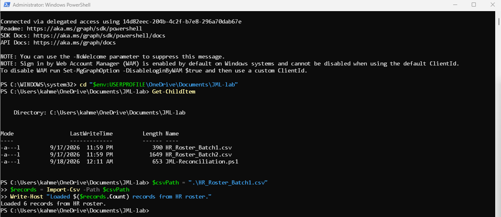

## What actually ran

| | |
|---|---|
| Accounts created | 26 |
| Department transfers | 4 |
| Offboards | 3 |
| PIM roles pulled | 1 |
| Total | 33 |

## Onboarding

For every row marked `New`, the script:

- Creates the account with department and title set
- Links a real manager object, not just a text field
- Drops them into their department's security group
- Logs the event
- Skips it entirely if the account already exists, so nothing breaks on a second run

```powershell
$newUser = New-MgUser -DisplayName $record.Name -UserPrincipalName $upn `
    -MailNickname $mailNickname -AccountEnabled -PasswordProfile $passwordProfile `
    -GivenName $firstName -Surname $lastName -JobTitle $record.JobTitle -Department $record.Department

$group = Get-MgGroup -Filter "displayName eq '$($record.Department)'"
New-MgGroupMember -GroupId $group.Id -DirectoryObjectId $newUser.Id
```

Before touching anything real, the script has a dry-run mode that just prints what it *would* do:

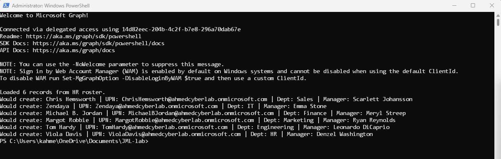

A couple of edge cases came up while testing — a person with no last name, and making sure re-running the script doesn't try to recreate people who already exist:

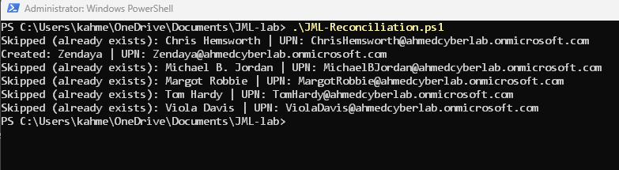

Checked against the portal afterward:

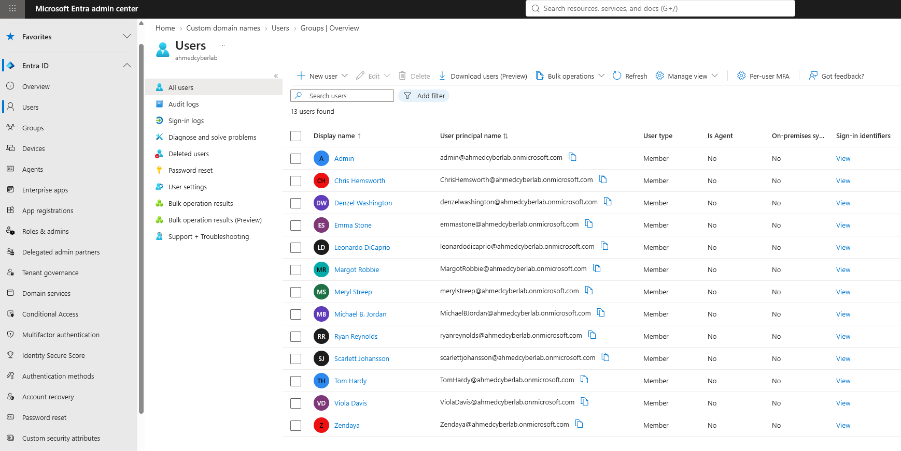
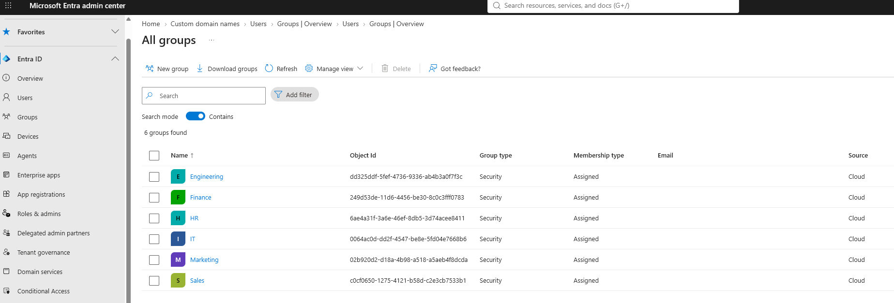
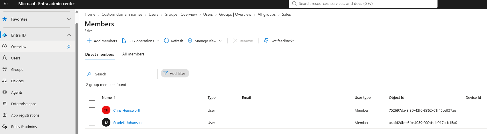

## Department transfers

For `Transfer` rows, the script:

- Pulls them out of their old department's group
- Adds them to the new one
- Updates the `Department` attribute (and title, if it changed)

```powershell
Remove-MgGroupMemberByRef -GroupId $oldGroup.Id -DirectoryObjectId $existingUser.Id
New-MgGroupMember -GroupId $newGroup.Id -DirectoryObjectId $existingUser.Id
Update-MgUser -UserId $existingUser.Id -Department $newDepartment -JobTitle $record.JobTitle
```

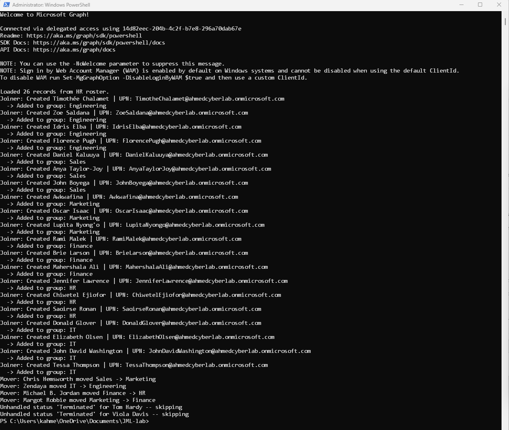

Checked both sides of the move in the portal — added to the new group, gone from the old one:

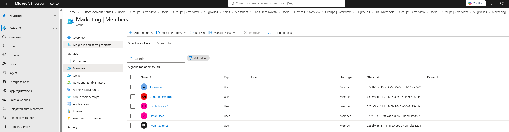
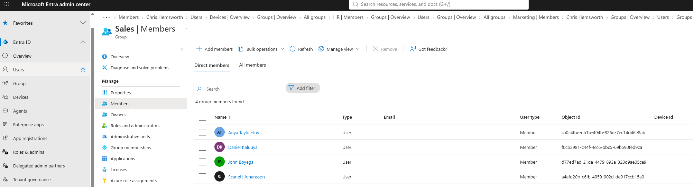

## Offboarding

For `Terminated` rows, the script runs through a full deprovisioning pass:

1. Disable the account
2. Reset the password to something random
3. Strip every group membership
4. Pull any active PIM eligible role assignments
5. Hide them from the address list

```powershell
Update-MgUser -UserId $existingUser.Id -AccountEnabled:$false

$memberships = Get-MgUserMemberOf -UserId $existingUser.Id -All
foreach ($m in $memberships) {
    Remove-MgGroupMemberByRef -GroupId $m.Id -DirectoryObjectId $existingUser.Id
}

$eligibleAssignments = Get-MgRoleManagementDirectoryRoleEligibilitySchedule -Filter "principalId eq '$($existingUser.Id)'"
foreach ($assignment in $eligibleAssignments) {
    New-MgRoleManagementDirectoryRoleEligibilityScheduleRequest -BodyParameter @{
        Action = "adminRemove"
        Justification = "Automated offboarding - JML reconciliation"
        RoleDefinitionId = $assignment.RoleDefinitionId
        DirectoryScopeId = $assignment.DirectoryScopeId
        PrincipalId = $existingUser.Id
    }
}

Update-MgUser -UserId $existingUser.Id -ShowInAddressList:$false
```

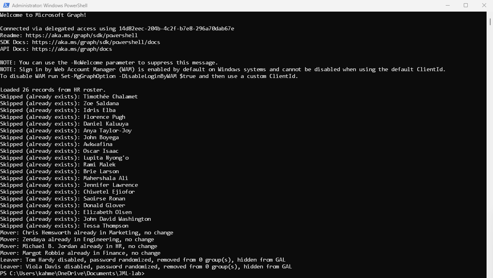

Portal check afterward — account disabled, zero groups, zero roles:

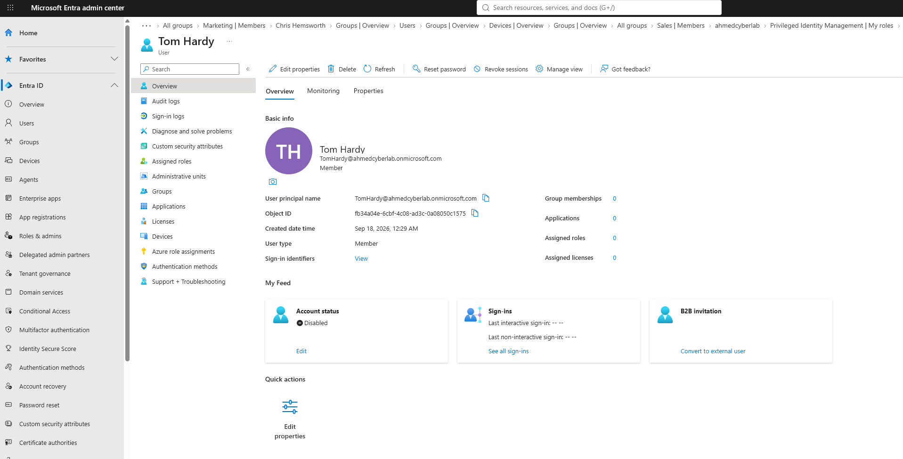

## PIM revocation

This is the part most basic offboarding scripts skip. If someone had a privileged role — even one they only had *eligibility* for, not active access — it needs to go when they leave. Here's a test role assigned to a still-active user, then revoked by the script once that same user was marked terminated:

**Before** — eligible role assigned:

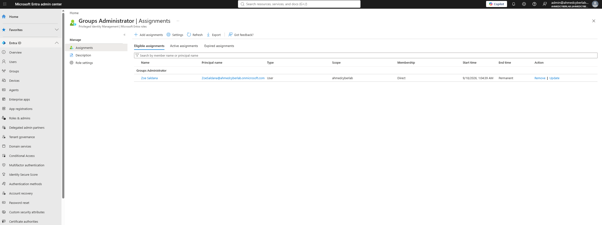

**The script revoking it:**

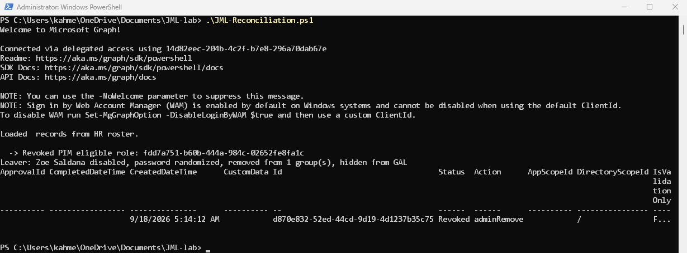
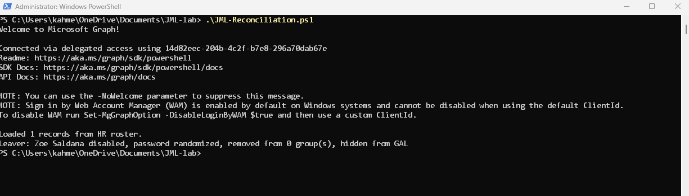

**After** — gone from PIM, confirmed in the portal:

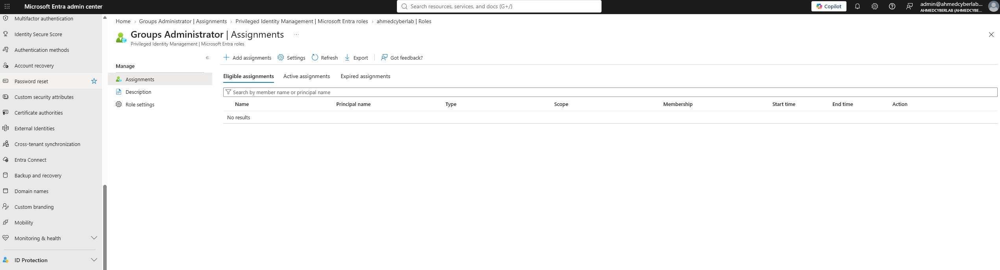

## Audit log

Every action above also writes a row here — separate from anything printed to the terminal, so there's a real record of what changed and when.

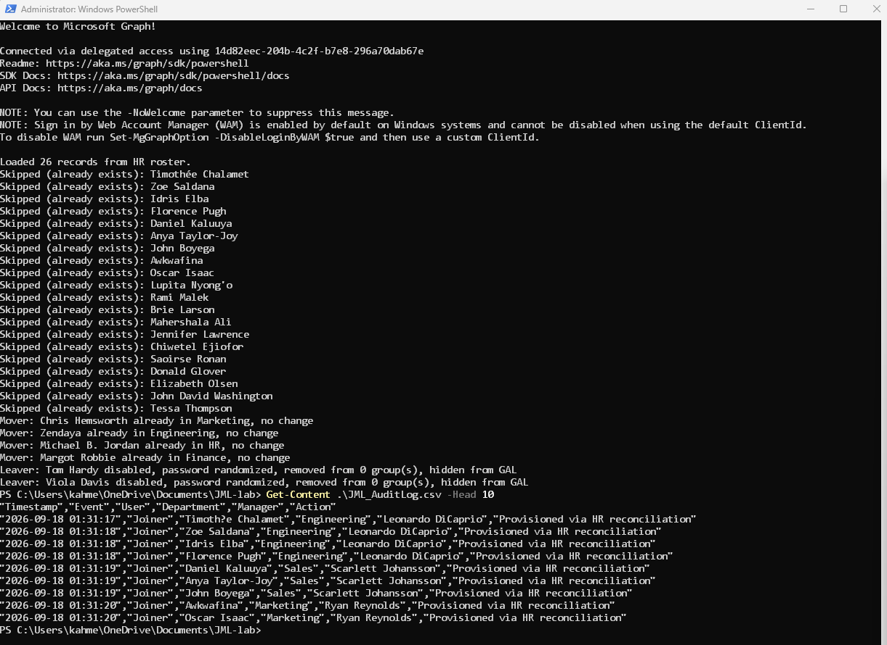

## Lessons learned

- **A working token doesn't mean every action will work.** Basic updates went through fine on an older session, but resetting someone's password (which Graph treats as a sensitive action) kept getting rejected until I fully disconnected and reconnected.
- **A one-row CSV isn't an array by default.** `Import-Csv` on a single record returns one object instead of a list, which breaks anything expecting `.Count`. Wrapping it in `@()` fixed it for good.
- **Not everyone has a last name in the data.** One test user broke the script until I made the surname field optional instead of assumed.
- **Re-running the script safely took real work, not luck.** Early versions errored out the second time they ran. Fixed by having every branch check "does this already exist / already match" before doing anything.

## Connect

[LinkedIn](#)
